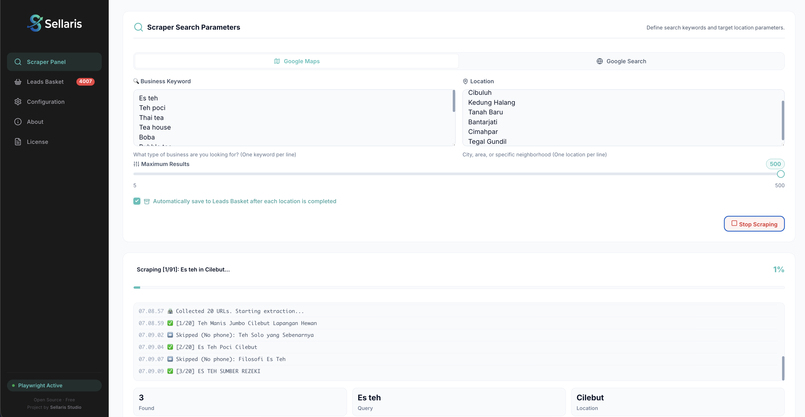
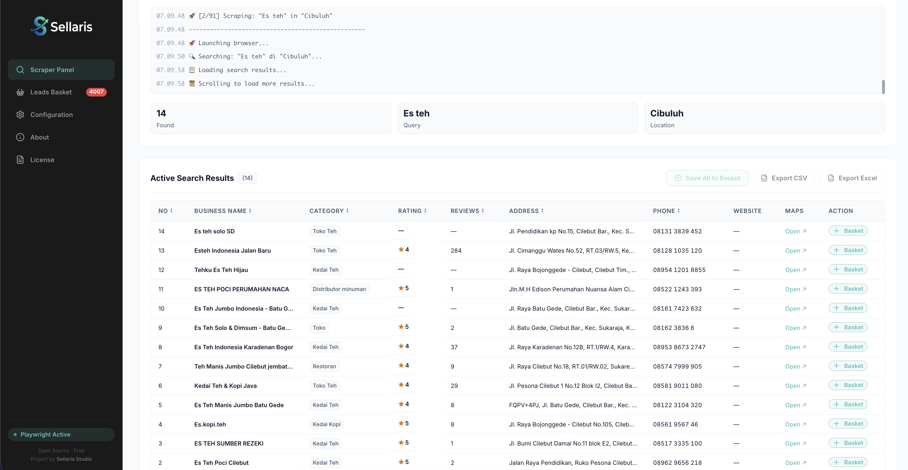
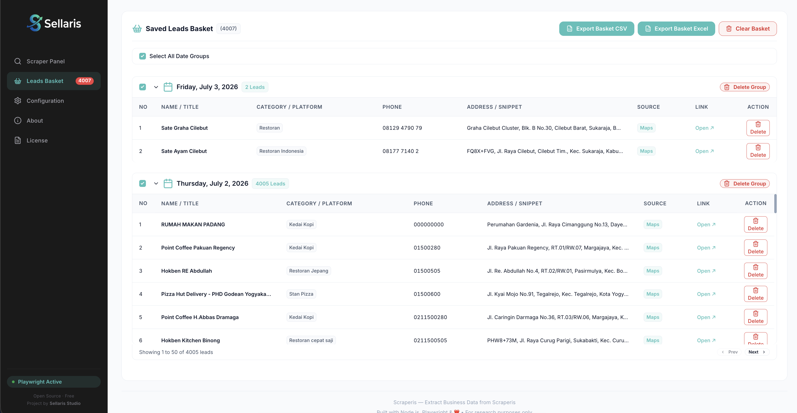
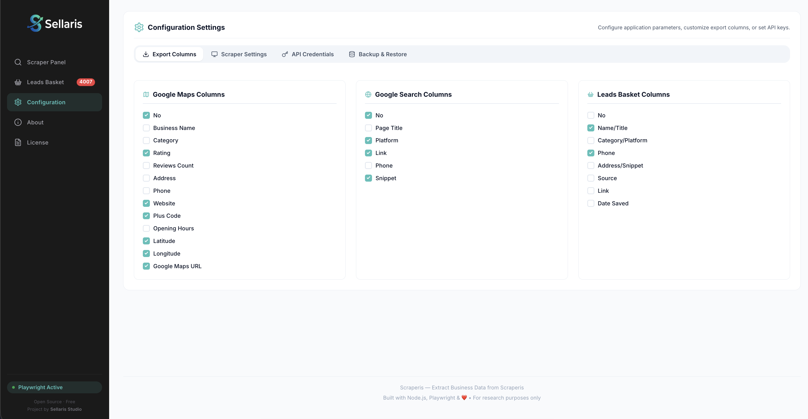
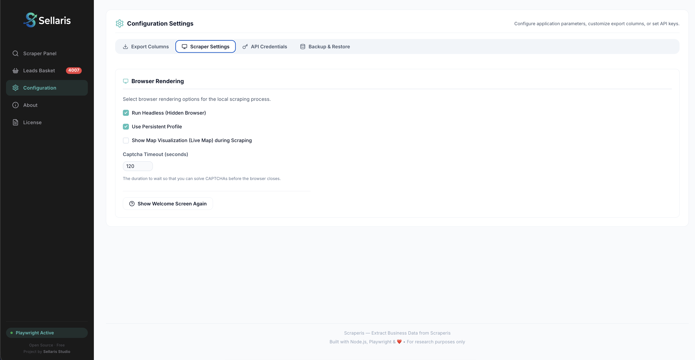
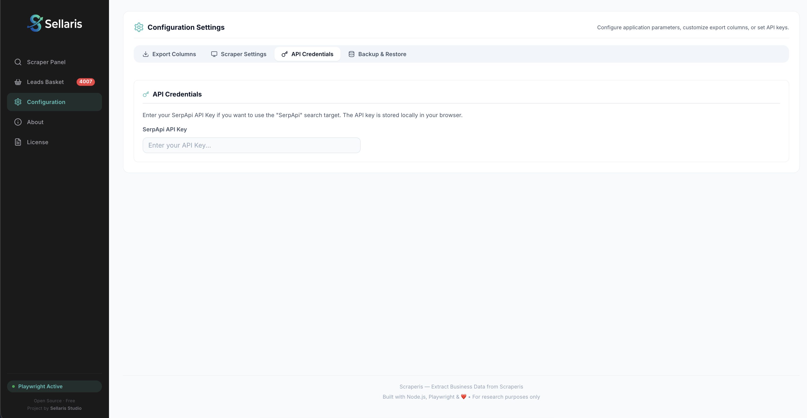

<div align="center">
  

# Scraperis 🚀

**Automated Google Maps & Google Search Business Lead Extractor**

[](https://github.com/sellarisstudio/scraperis/releases)
[](https://github.com/sellarisstudio/scraperis/stargazers)
[](https://github.com/sellarisstudio/scraperis/network/members)
[](https://github.com/sellarisstudio/scraperis)
[](https://github.com/sellarisstudio/scraperis/blob/main/LICENSE)

  <br/>

[](https://playwright.dev)
[](https://electronjs.org)
[](https://nodejs.org)
[](https://expressjs.com)

</div>

---

Scraperis is a powerful desktop application built with Electron, Node.js, Express, and Playwright. It enables users to automatically scrape, collect, and build a database of business leads (including name, category, rating, reviews, address, phone number, and website) from Google Maps and Google Search.

Features a modern glassmorphic web dashboard with real-time scraping progress, live execution logs (Server-Sent Events), a persistent **Leads Basket**, and exports to CSV/Excel.

<div align="center">
  <h3>
    <a href="https://github.com/sellarisstudio/scraperis/releases">📥 Download Latest Windows Installer (.exe)</a>
  </h3>
</div>

---

## ✨ Key Features

- **Dual Scraping Modes**:
  - 🗺️ **Google Maps Scraper**: Extracts business names, categories, ratings, reviews, addresses, phone numbers, website links, and maps URLs.
  - 🌐 **Google Search Scraper**: Targets social media platforms (Instagram, Facebook, TikTok, LinkedIn, or custom domains) with specific categories and contact prefixes (e.g. WhatsApp, WA.me) to grab contact info.
- **Sequence Scraping (Multi-Keywords & Multi-Locations)**: Input multiple keywords and locations (separated by newlines) inside textareas. Scraperis runs sequentially through every combination.
- **Leads Basket**: A local storage-based basket to accumulate leads from multiple scraping runs. Automatically filters and skips duplicates.
- **Direct CSV & Excel Export**: Select which columns to include and export data from either current scrape results or the Leads Basket.
- **Early cancellation**: Click the "Stop Scraping" button at any point to gracefully abort the active browser sessions and sequence loops.
- **Progress visualization**: Smooth progress bar calculating progress across all combinations with detailed real-time logs.

---

## 📸 Demo & Screenshots

<div align="center">
  <p><strong>Scraperis Interface & Features in Action</strong></p>
  
  <table>
    <tr>
      <td align="center" width="50%">
        
      </td>
      <td align="center" width="50%">
        
      </td>
    </tr>
    <tr>
      <td align="center" width="50%">
        
      </td>
      <td align="center" width="50%">
        
      </td>
    </tr>
    <tr>
      <td align="center" width="50%">
        
      </td>
      <td align="center" width="50%">
        
      </td>
    </tr>
  </table>
</div>

---

## 💻 Developer Installation & Run

To run Scraperis in your local development environment:

### Prerequisites

Make sure you have [Node.js](https://nodejs.org/) (v16+ recommended) installed on your system.

### Steps

1. **Clone the Repository**:

   ```bash
   git clone https://github.com/your-username-or-organization/scraperis.git
   cd scraperis
   ```

2. **Install Dependencies**:

   ```bash
   npm install
   ```

3. **Install Playwright Chromium Browser**:
   Install the required browser binary and its dependencies on your machine:

   ```bash
   npm run install-browser
   ```

4. **Environment Variables**:
   Copy `.env.example` to `.env` and configure if needed (e.g. adjust server ports or timeout values).

5. **Run the Development Server**:
   To start the backend server with watch mode enabled:

   ```bash
   npm run dev
   ```

   Open your browser and navigate to `http://localhost:3000`.

6. **Run as Desktop App (Electron)**:
   To run Scraperis in the Electron desktop wrapper:
   ```bash
   npm run electron:dev
   ```

---

## 📦 How to Compile/Build for Windows

If you want to package the app into a standalone Windows executable (`.exe` installer):

```bash
npm run build:win
```

This script runs `electron-builder` to package the application. The compiled installer executable will be saved in the `dist/` directory, typically named `Scraperis Setup <version>.exe`.

---

## 📥 How to Install and Run the `.exe` Release (For End Users)

If you just want to use the application without setting up Node.js, you can download the ready-to-run `.exe` installer directly from the [GitHub Releases page](https://github.com/sellarisstudio/scraperis/releases).

### Steps:

1. **Go to Releases**:
   Go directly to the [GitHub Releases page](https://github.com/sellarisstudio/scraperis/releases).
2. **Download the Installer**:
   Under the latest release, click on **Assets** and download the installer file (e.g. `Scraperis Setup <version>.exe`).
3. **Run the Installer**:
   - Double-click the downloaded `.exe` file.
   - If Windows Defender shows a warning (SmartScreen), click **More Info** and then **Run Anyway** (this occurs because the executable is not signed with a paid developer certificate).
   - Follow the wizard to choose your installation directory.
   - Click **Install** and then **Finish**.
4. **Launch & Start Scraping**:
   - Locate the **Scraperis** icon on your Desktop or in your Start Menu.
   - Open it and start pasting your keywords and locations to generate leads. (All dependencies and background chromium instances are managed automatically by the app).

---

## 📄 License

This project is licensed under the [MIT License](LICENSE).
